# Belly_Button_Biodiversity_Dashboard

# Overview

A research lab and food startup are looking to research bacterial species with which to successfully create a new brand of synthetic beef. The researchers have decided to focus their search for the best bacterial species candidates on bacteria species found in the navel of the human body. The team has gathered samples from research participants and constructed a dataset with bacteria species and other associated information for each participant's sample. The participants have been anonymized with ID numbers in the dataset. The goal of the research is to analyze the data collected from the samples to find the most optimal bacteria species (or combination) to produce the best tasting synthetic beef product possible.

To make the data accessible to both participants and fellow researchers, the team decided it would be best to create a deployable dashboard that can be accessed through a web browser to interact with the collected data for each participant ID and their respective sample. I have been tasked with creating this dashboard and deploying it. The dashboard contains a dropdown menu to filter the displayed information by participant ID, a demographics panel showing categorical information for the selected participant, and 3 interactive data visualizations allowing the viewer to analyze key data on the selected participant.

The dashboard can be accessed through a web browser by clicking [here](https://kevin-eapen.github.io/Belly_Button_Biodiversity_Dashboard/), or by copying and pasting the url below into the web browser address bar.

url: https://kevin-eapen.github.io/Belly_Button_Biodiversity_Dashboard/

# Results - Dashboard Interactivity

In this section, I will walk through each element in the completed dashboard and the levels of interactivity within each element.

## Dropdown Menu & Demographics Panel

The dropdown menu allows the user to select the participant ID to filter the dashboard information and visualizations by the selected ID number.

**Dropdown Menu Example:**

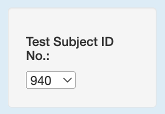  
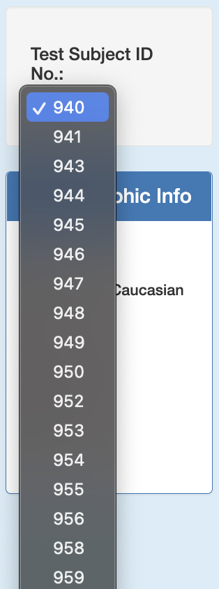

Once a participant ID is selected the elements on the dashboard will change to display data only related to the selection made. The element directly below the dropdown menu is a demographics panel that will display all the relevant demographics information for the selected participant ID. 

The example below displays the demographics panel once the Subject ID No. "940" is selected from the dropdown menu.

**Demographics Panel Example 1:**

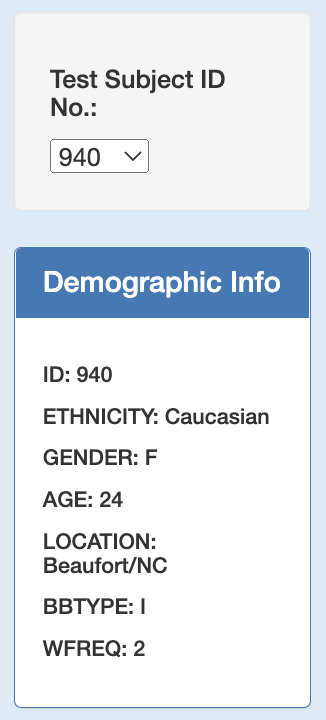

The example below displays the demographics panel once the Subject ID No. "946" is selected from the dropdown menu.

**Demographics Panel Example 2:**

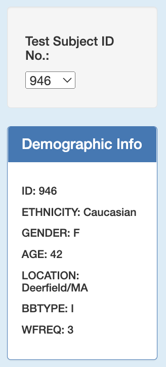

The example below displays the demographics panel once the Subject ID No. "954" is selected from the dropdown menu.

**Demographics Panel Example 3:**

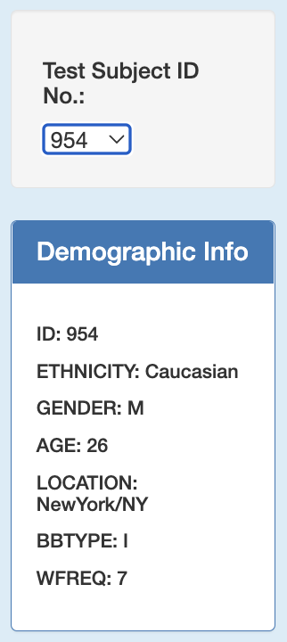

## Bar Chart

The bar chart, to the right of the dropdown menu, displays the top 10 quantities (ranked in descending order) of bacteria cultures found in the collected sample for the selected participant ID. The y-axis shows the OTU ID for each culture, and the x-axis displays the quantities of the bacteria cultures found. The chart also has hover interactivity, allowing the user to view each cultures' quantity value and species names by hovering near each bar with their desktop cursor.

The example below displays the bar chart once the Subject ID No. "940" is selected from the dropdown menu.

**Bar Chart Example 1:**

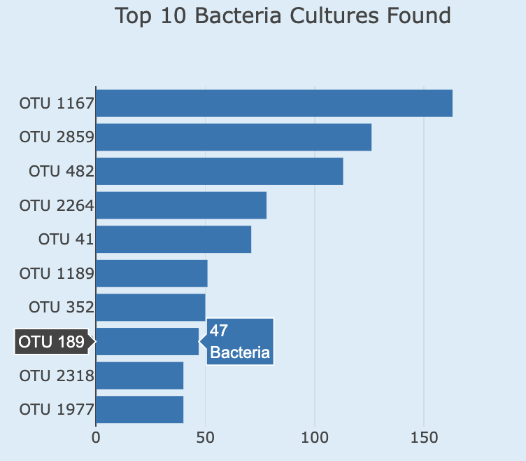

The example below displays the bar chart once the Subject ID No. "946" is selected from the dropdown menu.

**Bar Chart Example 2:**

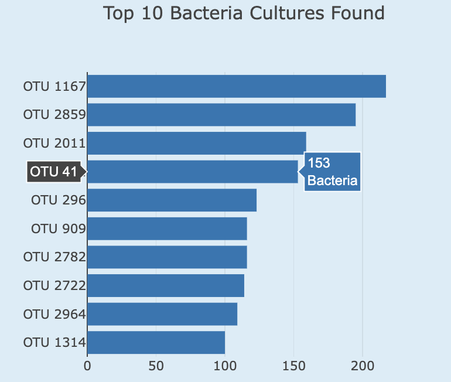

The example below displays the bar chart once the Subject ID No. "954" is selected from the dropdown menu.

**Bar Chart Example 3:**

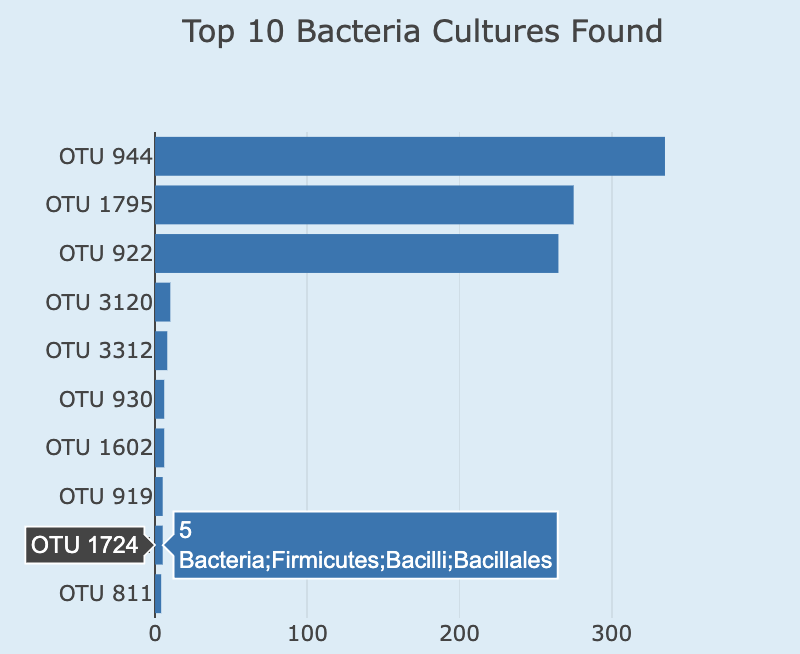

## Bubble Chart

The bubble chart, at the bottom of the dashboard, plots the bacteria cultures per sample. The y-axis represents the quantities of the cultures and the x-axis represents the the cultures' OTU IDs. The color scales (plotly 'Earth' colorscale) according to the OTU ID and the size scales according to the quantity of the cultures found. The chart has interactive functionality, allowing the user to hover with their desktop cursor to reveal bacteria culture quantity, OTU ID, and bacterial species names.

The example below displays the bubble chart once the Subject ID No. "940" is selected from the dropdown menu.

**Bubble Chart Example 1:**

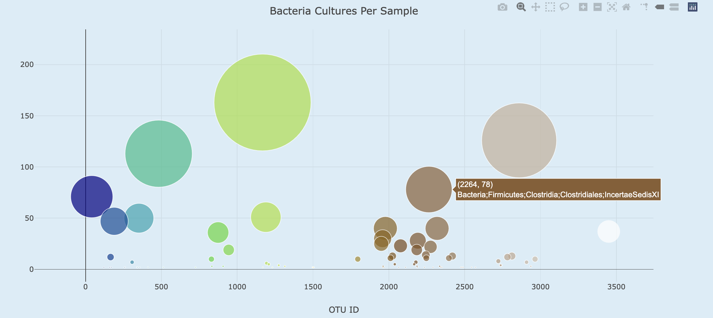

The example below displays the bubble chart once the Subject ID No. "946" is selected from the dropdown menu.

**Bubble Chart Example 2:**

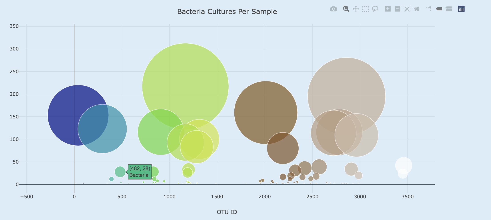

The example below displays the bubble chart once the Subject ID No. "954" is selected from the dropdown menu.

**Bubble Chart Example 3:**

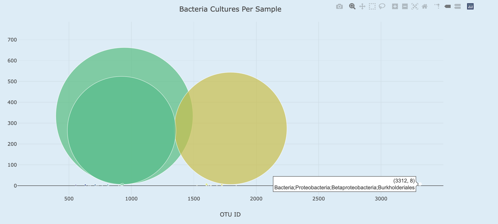

## Gauge Chart

The gauge chart, directly to the right of the bar chart, visualizes the frequency with which the selected participant washes their belly button. The washing frequency is measured by number of times the participant washes (scrubs) their belly button per week. This value is displayed in large font in the middle of the gauge. The gauge shows a washing frequency range of 0 to 10. The dark blue bar changes in length along the arc of the gauge to represent where the washing frequency value, for the selected participant, lies within the designated range (0 to 10).

The example below displays the gauge chart once the Subject ID No. "940" is selected from the dropdown menu.

**Gauge Chart Example 1:**

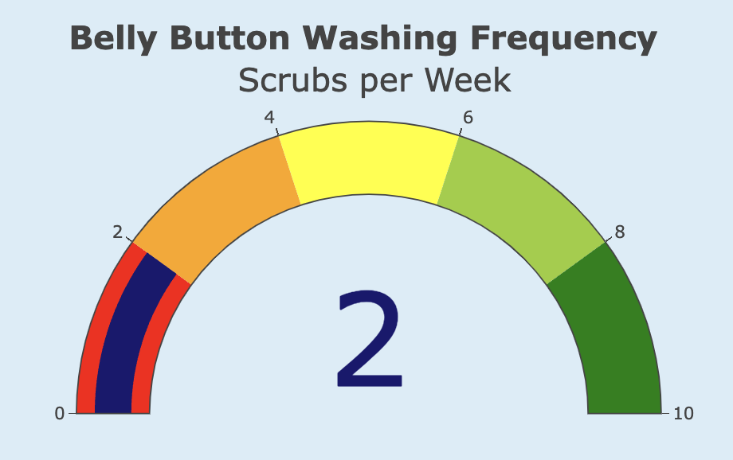

The example below displays the gauge chart once the Subject ID No. "946" is selected from the dropdown menu.

**Gauge Chart Example 2:**

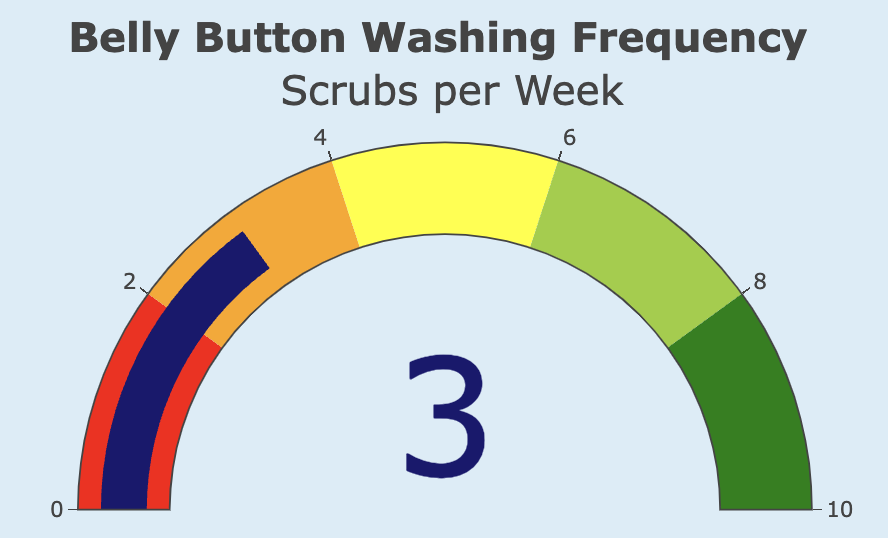

The example below displays the gauge chart once the Subject ID No. "954" is selected from the dropdown menu.

**Gauge Chart Example 3:**

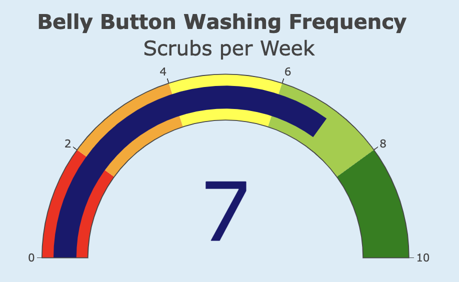

## Additional Customizations

In addition to positioning the elements within the dashboard and formatting the page with html and bootstrap templates, I used javascript and css stylesheet customizations to change a few visual elements of the web page hosting the dashboard data visualizations.

3 main visual customizations are labeled in the image below:

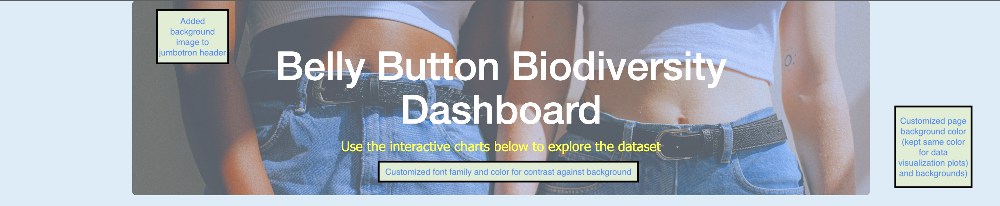

**Customizations**
- Used a jpeg image, sourced from a public domain images website (pexels.com), as a background image for the web page's bootstrap jumbotron header.
- Changed font color of jumbotron header text to white, and the font color of the subheading to yellow for greater contrast and visibility against the background image. Additionally, customized the font family for the subheading, now using "Tahoma".
- Changed the background color of the web page in HTML template and in javascript plotly code for the data visualizations. Color used follows hex code: "#D9EDF7".  

# Summary

The research team's goal was to make the data collected in their belly button biodiversity research accessible to research participants and fellow researchers. I executed this deliverable by deploying a dashboard containing a dropdown menu, demographics panel, and 3 interactive data visualizations hosted on Github Pages. All deliverable requirements, along with customizations, have been satisified, and the url link hosting the dashboard has been provided.